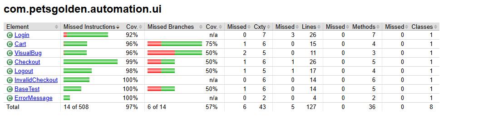
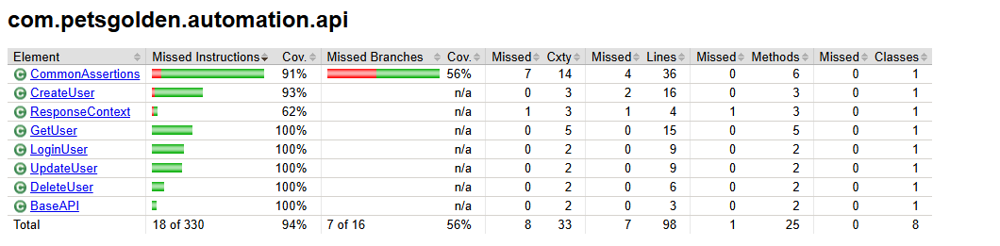

# sauce-petgolden-automation

## Automated Technical Test - PetsGolden

### Overview

This project is an automated testing suite designed to validate the functionality of the PetsGolden web application and its API endpoints. The automation tests are implemented using Java, Selenium WebDriver for web UI testing, and Cucumber for behavior-driven development (BDD) style test scenarios. The API tests leverage Spring (if applicable) to perform integration testing on RESTful services.

### Technology Stack

- Java 17+
- Selenium WebDriver
- Cucumber JVM
- Spring Boot (optional, for API testing)
- Maven (for build and dependency management)
- JUnit/TestNG (test runner)
- REST Assured or HTTP client (for API calls)
- Git for version control

### Features Tested

#### Web & UI Tests
- User authentication and login/logout workflows
- Navigation across key pages of the PetsGolden website
- Form input validation and error message handling
- CRUD operations on user profiles or pets (depending on app scope)
- Validation of UI elements and dynamic content loading

#### API Tests
- Endpoint validation for user management (Create, Read, Update, Delete)
- Response status codes and payload verification
- Modular validation of response messages and fields
- Edge cases and negative test scenarios such as deleting non-existent users

### Highlights
- Modular and reusable validation methods for API response fields
- Cucumber feature files for readable and collaborative test scenarios
- Avoidance of personal data in test cases (no real user names)
- Tests structured to run sequentially or independently for CI/CD integration

### Test Coverage Report

Test coverage is collected using **JaCoCo** and visually represented in the reports below.

#### Web UI Test Coverage


#### API Test Coverage


> The coverage reports help evaluate how much of the application logic is tested through automation. Higher coverage indicates better test assurance, especially for core business logic and edge cases.

### Coverage Table Explanation

| Column                  | Meaning                                                               |
| ----------------------- | --------------------------------------------------------------------- |
| **Element**             | Java class name (e.g. from `com.petsgolden.automation.ui`).           |
| **Missed Instructions** | Number of bytecode instructions not executed during tests.            |
| **Cov.** (Instr.)       | Percentage of instructions covered by tests.                          |
| **Missed Branches**     | Conditional paths (e.g. `if/else`) not tested.                        |
| **Cov.** (Branches)     | Percentage of decision branches tested.                               |
| **Missed**              | Total number of instructions and branches not covered by the tests.                   |
| **Cxty**                | Cyclomatic complexity — indicates logic complexity of a class/method. |
| **Missed Lines**   | Number of lines **not executed** by any test (missed lines).            |
| **Lines**                 | Total number of source code lines in the class.                        |
| **Missed Methods** | Methods that were **never invoked** during test execution (missed methods). |
| **Methods**               | Total number of methods defined in the class.                           |
| **Missed Classes** | Classes that were loaded but had **no executed code** inside (missed classes). |
| **Classes**               | Total classes loaded (usually 1 per file).                              |


### How to Run

- Clone the repository
- Install Java and Maven on your PC
- Run the following command to execute tests **(only one test type at a time)**:

```bash
# Run Web tests 
mvn clean test -Dtest=com.petsgolden.runner.UITest

# Run API tests 
mvn clean test -Dtest=com.petsgolden.runner.APITest
